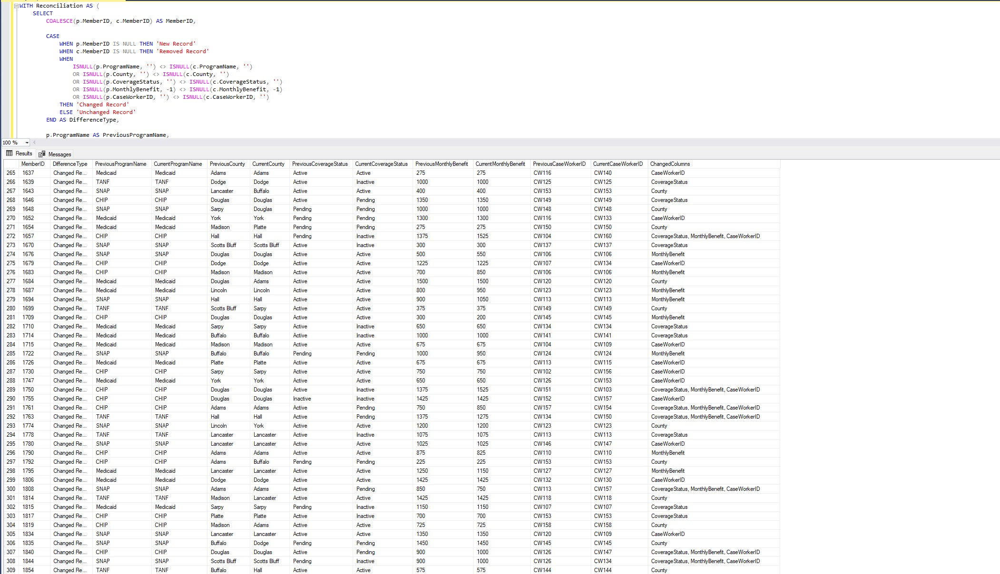
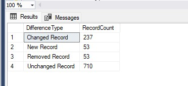

# Healthcare Eligibility SQL Reconciliation

## Project overview
This portfolio project demonstrates how SQL can compare two healthcare eligibility data snapshots and identify new, removed, changed, and unchanged records.
The project uses synthetic data only. It does not contain protected health information or real member information.

## Business scenario
An analyst receives two eligibility extracts from different reporting periods:
- `Eligibility_Previous`: the earlier snapshot
- `Eligibility_Current`: the updated snapshot

Before dashboards or reports are refreshed, the analyst needs to verify what changed and confirm the integrity of the latest file.

## Dataset
Each table contains 1,000 synthetic records with these columns:
| Column | Description |
|---|---|
| MemberID | Unique member identifier |
| ProgramName | Medicaid, CHIP, SNAP, or TANF |
| County | Nebraska county |
| CoverageStatus | Active, Pending, or Inactive |
| MonthlyBenefit | Simulated monthly benefit amount |
| CaseWorkerID | Simulated assigned caseworker |

The current dataset includes realistic changes such as:
- new members
- removed members
- coverage-status changes
- benefit changes
- county changes
- caseworker reassignments

## Repository files
- `01_Create_Tables.sql` — creates the SQL Server tables
- `02_Import_Data_Instructions.sql` — explains how to import the CSV files
- `03_Data_Reconciliation.sql` — returns all new, removed, and changed records
- `04_Summary_Report.sql` — summarizes the number of records by difference type
- `data/Eligibility_Previous.csv` — prior-period dataset
- `data/Eligibility_Current.csv` — current-period dataset

## SQL techniques demonstrated
- `FULL OUTER JOIN`
- `CASE`
- `COALESCE`
- `ISNULL`
- `CONCAT_WS`
- common table expressions
- record-level and field-level change detection

## Business value
This process provides a repeatable alternative to manually comparing large files in Excel. It can improve data-quality controls, support auditability, and reduce the risk of publishing reports based on incomplete or inconsistent data.

## How to run the project
1. Run `Create Tables.sql`.
2. Import both CSV files into their corresponding tables.
3. Run `Data Reconciliation.sql`.
4. Run `Summary Report.sql`.

## Data Reconciliation Results

## Summary Report

# Key Skills Demonstrated

This project demonstrates my ability to:
- Compare large healthcare datasets using SQL
- Validate data before reporting and dashboard development
- Detect new, removed, and modified records
- Identify field-level changes for auditing and quality assurance
- Build repeatable SQL solutions instead of relying on manual Excel comparisons

## Tools Used

- SQL Server Management Studio (SSMS)
- GitHub
